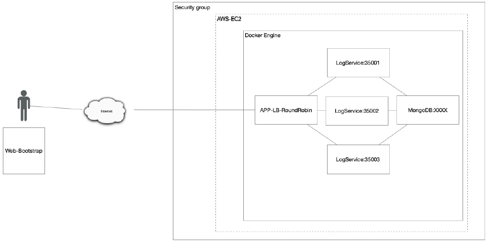
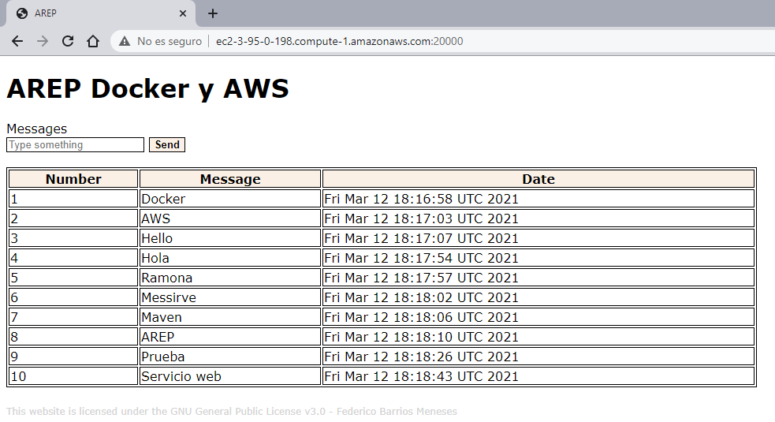
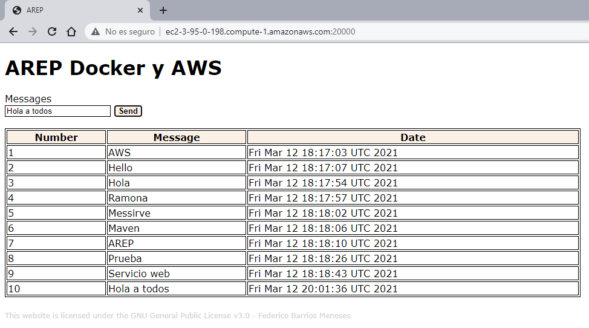

# MODULARIZACIÓN CON VIRTUALIZACIÓN UTILIZANDO DOCKER Y AWS
Docker empaqueta software en unidades estandarizadas llamadas [contenedores](https://aws.amazon.com/es/containers/) que incluyen todo lo necesario para que el software se ejecute, incluidas bibliotecas, herramientas de sistema, código y tiempo de ejecución. La ejecución de Docker en AWS ofrece una manera muy sencilla de crear y ejecutar aplicaciones distribuidas.
El objetivo de este proyecto es hacer uso de dichas herramientas para crear una aplicación distribuida que registre y consulte una serie de cadenas almacenadas en una base de datos Mongodb,  la aplicación tiene la siguiente arquitectura:



## ¿Cómo empezar?
### Requerimientos
- [Java 8](https://www.java.com/es/)
- [Maven](https://maven.apache.org/download.cgi)
- [GIT](https://git-scm.com/downloads)
- [Docker](https://docs.docker.com/desktop/)
  
### Instalación

 >Para ver el código fuente del proyecto:
 >```
 >git clone https://github.com/federico29/AREP-TallerAWS.git
 >```

>Consultar las imágenes de Docker utilizadas: [Imágenes](https://hub.docker.com/r/fede2906b/first-spark-java-repository/tags?page=1&ordering=last_updated).

>Para obtener una copia de las imágenes puede ejecutar los siguientes comandos:
>```
>docker pull fede2906b/first-spark-java-repository:loadbalancer
>```
>```
>docker pull fede2906b/first-spark-java-repository:logservice
>```
>```
>docker pull fede2906b/first-spark-java-repository:database
>```

## Pruebas
 >El funcionamiento de la aplicación se puede apreciar en las siguientes imágenes:
 >
 >Se añade una nueva cadena:
 >

## Documentación
> Documentación del servicio LogService: [Documentacion](https://federico29.github.io/AREP-TallerAWS/logservice/Documentacion/).

> Documentación del servicio LoadBalancer: [Documentacion](https://federico29.github.io/AREP-TallerAWS/loadbalancer/Documentacion/).

> Puede generar la documentación del proyecto ejecutando el siguiente comando en el directorio AREP-TallerAWS/loadbalancer/ o AREP-TallerAWS/logservice/:
> ```
> mvn javadoc:javadoc
> ```

## Construido con
- Maven
- Java 8
- GIT
- Amazon Web Services
- Docker

## Autor
> Federico Barrios Meneses - Estudiante de Ingeniería de Sistemas.

## Licencia
Este proyecto está bajo la [Licencia GNU General Public License](https://github.com/federico29/AREP-TallerAWS/blob/master/LICENSE.txt).

